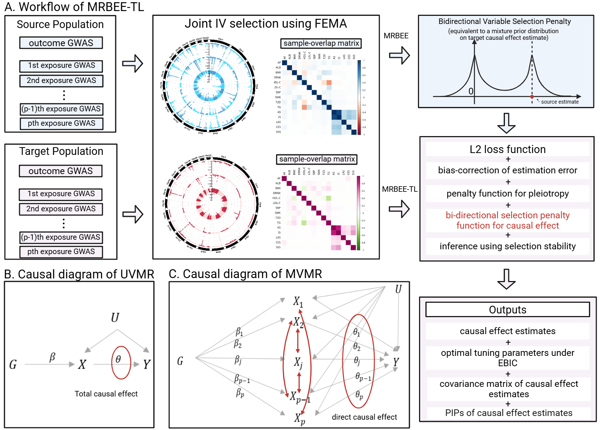

MRBEEX: An Enhanced Multivariable Mendelian Randomization Method
================

# Installation

You can install the MRBEEX package directly from GitHub using the
following command:

    # Install the devtools package if you haven't already
    if (!requireNamespace("devtools", quietly = TRUE))
      install.packages("devtools")

    # Install MRBEEX from GitHub
    devtools::install_github("harryyiheyang/MRBEEX")

# MRBEEX

## Overview of Mendelian Randomization

Mendelian randomization (MR) is an instrumental variable (IV) method
that leverages genetic variants as IVs to estimate the causal effects of
exposures on outcome phenotypes.

Multivariable MR (MVMR), which considers multiple exposures
simultaneously, offers a compelling solution to the direct causal
effects of exposures on the outcome.

MR relies on three key conditions called the valid IV conditions: (IV1)
the genetic variants must be strongly associated with the exposure,
(IV2) their association with the outcome must occur solely through the
exposure, and (IV3) they must be independent of confounders of the
exposure-outcome relationship.

Genetic variants that violate (IV2) or (IV3) are considered to exhibit
uncorrelated horizontal pleiotropy (UHP) or correlated horizontal
pleiotropy (CHP), respectively, while variants that fail to meet (IV1)
are referred to as weak instruments.

## Motivation of MRBEEX

However, current MVMR methods assume that IVs are independent, which may
overlook a type of bias known as linkage bias, a specific form of CHP
bias. When independent causal/associated variants are selected as IVs
based on exposures, underlying causal variants of the outcome that are
in LD with these IVs represent underlying CHP, leading to CHP bias.
Unlike the secondary causal pathways described in the literature that
are independent of the primary causal pathway, these CHP variants are
directly linked through LD.

We extend our previously developed MVMR method, MR using bias-corrected
estimating equation (MRBEE) to address the linkage bias. This enhanced
MRBEE (MRBEEX) is based on the summarized-statistics-based model. MRBEEX
contains two MVMR methods, i.e., MRBEE-IPOD and MRBEE-Mixture, to
accommodate different practical scenarios. MRBEE-IPOD uses the iterative
penalized outlier detection (IPOD) algorithm to detect large UHP and
CHP, while MRBEE-Mixture applies the expectation-maximization (EM)
algorithm to identify the pathways of valid IVs and CHP, respectively.
Sum of single effects (SuSiE) is also incorporated into MRBEE-IPOD and
MRBEE-Mixture to select exposures with non-zero causal effects,
enhancing interpretability.

# Cis-MRBEE

## Overview of cis-Mendelian Randomization

Multivariable cis-Mendelian randomization (cis-MVMR) has proven to be an
effective approach for addressing phenotypic diversity within genomic
regions. The potential applications of cis-MVMR include identifying
therapeutic targets that influence disease susceptibility.

However, biases arising from invalid IVs, such as weak instrument bias
and horizontal pleiotropy, have not been addressed.

## Cis-MRBEE

We extend the Mendelian randomization bias-correction estimating
equation (MRBEE) to cis-MVMR, resulting in cis-MRBEE, which
simultaneously addresses both weak instrument and horizontal pleiotropy
biases.

Compared to conventional MRBEE, cis-MRBEE mitigates weak instrument bias
by leveraging the sparse genetic architecture—wherein most variants
within a genomic region are associated through LD with a few causal
variants.

Cis-MRBEE will first sparsely predict the GWAS effect sizes of exposures
using the underlying causal variants. Next, cis-MRBEE will apply the
MRBEE-IPOD to estimate the causal effects and control the horizontal
pleiotropy. In cis-MVMR, there should only be one causal pathway and
hence the CHP should not present. As a result, we dot not extend the
MRBEE-Mixture int cis-MRBEE.

## Tutorial

We also provide a real locus data analysis code and data for
cis-MRBEE.  
The data can be downloaded from
[example-data.zip](https://www.dropbox.com/scl/fi/s2xepxdvquz94nm0dsqd8/CisMRBEE_Real_Data.zip?rlkey=0lio3ou8y1jno8kh51uln7lun&st=g49z2v0j&dl=0).  
For a step-by-step guide on how to use cis-MRBEE for data analysis,
please refer to the tutorial:
[Tutorial-of-CisMRBEE.pdf](Tutorial-of-CisMRBEE.pdf).

# MRBEE-TL

## Motivation of MRBEE-TL

Multivariable Mendelian randomization (MVMR) methods are typically
developed and validated in European ancestry populations. However, many
researchers are now interested in applying MR to underrepresented
populations, such as East Asian or African groups. In these populations,
the smaller sample sizes and different genetic architectures make it
challenging to obtain stable and accurate causal effect estimates.

MRBEE-TL addresses this issue by improving power in the target
population through information sharing. Specifically, it leverages
causal effect estimates from a well-powered European (source) population
to guide estimation in a smaller or less-powered target population. At
the same time, MRBEE-TL is designed to detect which effects are truly
transferable and which ones are population-specific, helping avoid
misleading generalizations across ancestries.

## Advantages of MRBEE-TL

MRBEE-TL is particularly useful for researchers aiming to generalize
findings beyond European cohorts, and for identifying
population-specific risk factors that may inform targeted interventions
or therapies.

- Improved estimation in underrepresented populations: MRBEE-TL
  increases power and accuracy by borrowing strength from large source
  data.

- Identification of transferable vs. non-transferable effects: The
  method separates shared causal effects from population-specific
  signals, providing more interpretable results.

- Robustness to weak instruments and pleiotropy: MRBEE-TL inherits the
  bias-correction properties of MRBEE, reducing the impact of common
  sources of bias.

- Automatic selection of causal exposures: Through integrated variable
  selection, MRBEE-TL highlights exposures with the strongest and most
  reliable evidence.
